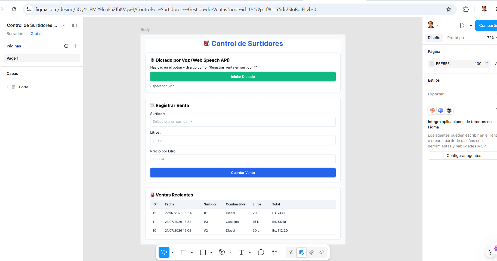

# ⛽ Sistema de Control de Surtidores y Ventas

Sistema web para la gestión de ventas, surtidores y alertas en estaciones de servicio, desarrollado con conexión a **Supabase** en tiempo real e integración con **Web Speech API** para reconocimiento de voz.

---

## 📸 Prototipado UI/UX en Figma

### Prototipo de Interfaz


---

## 🛠️ Tecnologías y Herramientas Utilizadas

- **Frontend:** HTML5, CSS3, JavaScript (ES6+)
- **Base de Datos & Backend:** [Supabase](https://supabase.com/) (PostgreSQL)
- **APIs del Navegador:** Web Speech API (Reconocimiento de voz)
- **Control de Versiones:** Git & GitHub
- **Prototipado UI/UX:** Figma
- **Entorno de Desarrollo:** Visual Studio Code

---

## 🗄️ Estructura de la Base de Datos

El modelo relacional incluye las siguientes tablas principales:

- **`surtidores`**: Contiene la información de los tanques (`id`, `numero`, `combustible`, `capacidad`, `nivel`).
- **`ventas`**: Registra las transacciones realizadas (`id`, `fecha`, `combustible`, `litros`, `precio`, `total`, `surtidor_id`).
- **`alertas`**: Notificaciones de fallas o nivel bajo (`id`, `surtidor_id`, `tipo`, `fecha`, `estado`).

---

## 🚀 Ejecución Local

1. Clona el repositorio:
   ```bash
   git clone [https://github.com/Rafit123/control_surtidores.git](https://github.com/Rafit123/control_surtidores.git)
   ```
2. Abre `index.html` directamente en tu navegador o mediante la extensión **Live Server** de VS Code.